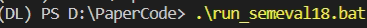
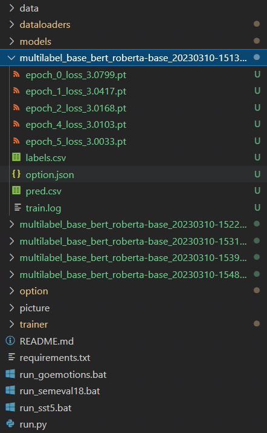
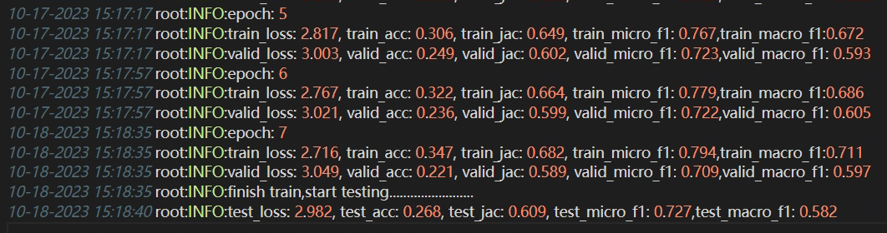

# Install requirements
```
pip install -r requirements.txt
```
# run with command
## goemtions
```
python run.py --dataset goemotions --optimizer adamw --model_name multilabel_base_bert --pretrained_bert_name roberta-base --bert_dim 768  --max_seq_len 128 --s 12  --seed 2022 --num_epoch 8 --threshold 0.2 --learning_rate 1e-5
```

## semeval18
```
python run.py --dataset semeval18 --optimizer adamw --model_name multilabel_base_bert --pretrained_bert_name roberta-base  --bert_dim 768 --max_seq_len 128 --s 12  --seed 2022 --num_epoch 8 --threshold 0 --learning_rate 1e-5
```

# run with bat
## In bat file, a random seed that decrements from 2022 is automatically applied
```
SET COUNT=2022
:MyLoop
    IF "%COUNT%" == "2016" GOTO EndLoop
    python run.py --dataset semeval18 --optimizer adamw --model_name multilabel_base_bert --pretrained_bert_name roberta-base  --bert_dim 768 --max_seq_len 128 --s 12  --seed %COUNT% --num_epoch 8 --threshold 0 --learning_rate 1e-5
    SET /A COUNT-=1
    GOTO MyLoop
:EndLoop
```
## So you can simply use bat file with serial random seed
```
.\run_semeval18.bat
.\run_goemotions.bat
.\run_sst5.bat
```

# Result
## It will auto save the log file for each epoch,and it will save the model with the lowest loss on the validation set.
## Afterwards, the model will be automatically loaded and tested on the test set, and the resulting metrics will be recorded in the log file. Additionally, the true labels and predictions will be saved in a CSV file after testing.
## You can find them in root dir after running.
# Some picture about this work
## Run this work

## After work finished,some output in this dir

## train.log file shows the whole process

